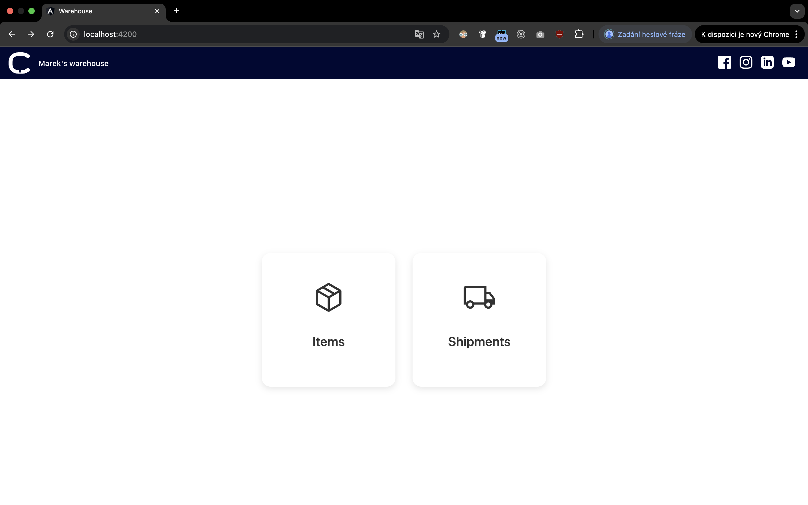
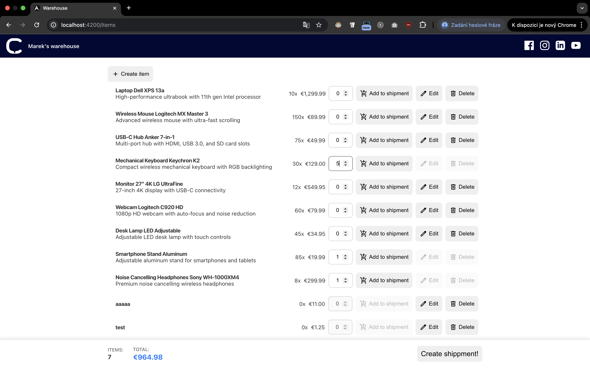
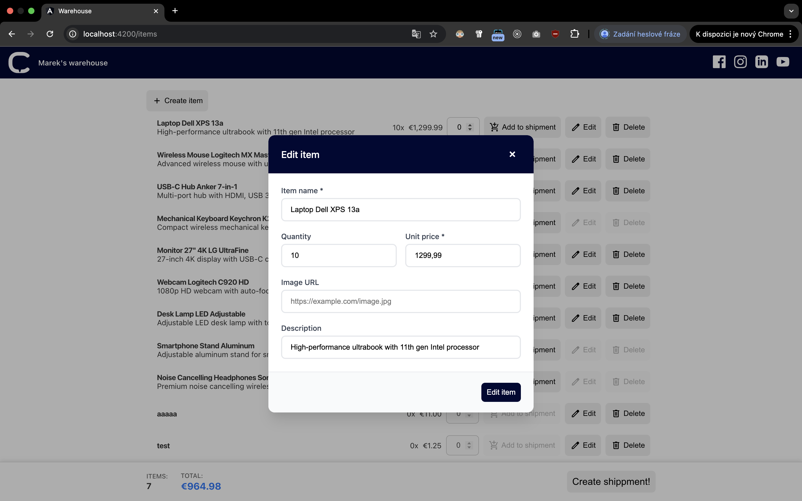

# Warehouse Interview Homework

This project is my solution to the interview homework. The goal was to build a small **Warehouse application** with both backend and frontend functionality.

---
## Screens
<p align="center">
  
  
  
</p>


## Tech Choices

For the backend, I used NestJS, my go-to framework. Since it was also mentioned as a nice-to-have in the job description, I wanted to showcase my skills with it.

The backend exposes a REST API under `/items` and `/shipment`, backed by **SQLite + TypeORM**. The database is automatically seeded with mock data on startup.

The frontend is built with **Angular** with **custom state management** solution that keeps one source of truth.

I also prepared both **backend and frontend tests** to cover the main functionality.

---

## Endpoints

 `/items`:

- `GET /items` → Get all items
- `GET /items/:id` → Get a single item by ID
- `POST /items` → Create a new item
- `PATCH /items/:id` → Update an existing item
- `DELETE /items/:id` → Remove an item

`/shipments`:

- `GET /shipments` → Get all shipments
- `POST /shipments` → Create a new shipment
- `DELETE /shipments/:id` → Remove a shipments
---

## Running the Project

1. **Backend (NestJS API)**
```
cd backend
npm i 
npm run start
```

2. **Frontend (Angular)**
```
cd frontend
npm i 
ng serve
```

## Running tests

1. **Backend (Jest)**
```
cd backend
npm i 
npm run test
```

2. **Frontend (Karma)**
```
cd frontend
npm i 
ng test
```
